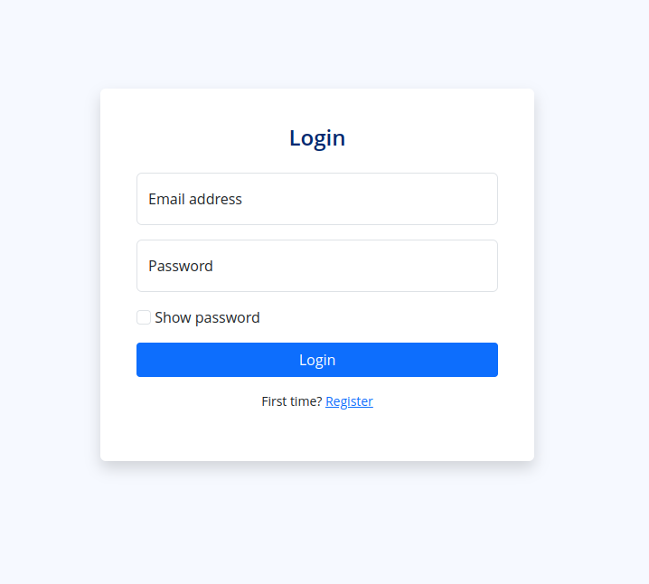
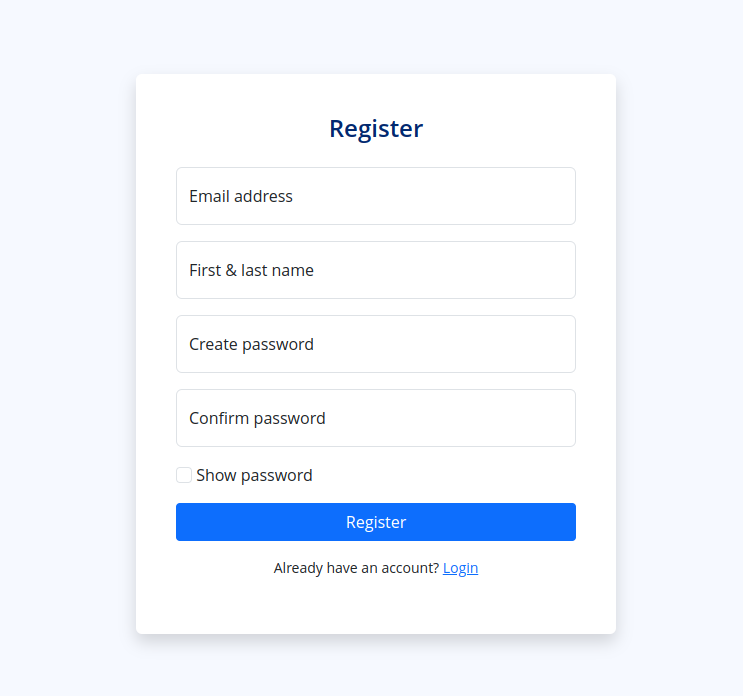

## Using `frbs` with shiny

This example shows how you can use `frbs` with shiny.

The assumption is that you **really** need a customized UI. If not, you're 
better off using other approaches eg. [firebase](https://github.com/JohnCoene/firebase)

## Prerequisites

1. Create a [Firebase project](https://console.firebase.google.com/).
1. Grab the project's API key and place it in your `.Renviron` as `FIREBASE_API_KEY`:

    ```r
    FIREBASE_API_KEY = Your-API-Key-Goes-Here
    ```
1. Restart your R session.
1. Ensure you have these packages installed:
      - shiny
      - bslib
      - htmltools
      - shinyjs
      - shinytoastr

## Login page



## Registration page


